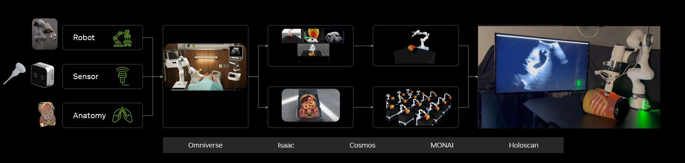

# NVIDIA Isaac for Healthcare

**Nvidia Isaac for Healthcare is the 3-computer solution for healthcare robotics**, allowing simulation, training and deployment of AI solutions. It extends and tailors [Isaac Sim](https://developer.nvidia.com/isaac-sim) and [Isaac Lab](https://developer.nvidia.com/isaac-lab) and [Omniverse](https://www.nvidia.com/en-us/omniverse/) to enable multi-scale simulation from anatomy to sensors, surgical instruments, robotic systems, operating rooms, intensive care units, labs, sterile processing departments (SPD), and full hospital environments. NVIDIA Isaac for Healthcare leverages [Nvidia Holoscan](https://github.com/nvidia-holoscan) for hardware-in-the-loop (HIL) simulation and Sim2Real deployment of trained algorithms and policies.

NVIDIA Isaac for Healthcare is a domain-specific framework built on top of [NVIDIA Isaac Sim](https://developer.nvidia.com/isaac-sim), [Nvidia Isaac Lab](https://developer.nvidia.com/isaac/lab), [NVIDIA Omniverse](https://www.nvidia.com/en-us/omniverse/) and [Nvidia Holoscan](https://github.com/nvidia-holoscan), enabling developers to design, simulate, test, train and deploy AI-enabled robots and autonomous systems, and generate synthetic data across:
- **Therapeutics**: e.g., surgical robotics, interventional radiology and radiotherapy
- **Diagnostics**: e.g., ultrasound (US), computed tomography (CT), cone-beam CT (CBCT)
- **Hospital & patient care**: e.g., hospitals, operating rooms and intensive care units with medication delivery, supply transport, disinfection robots, cobots
- **Rehabilitation & assistive technologies**: e.g., physical therapy robots, exoskeletons, etc.

## 🚀 Getting started

Get started with NVIDIA Isaac for Healthcare by exploring our core components:

| Component | Description | Repository |
|-----------|-------------|------------|
| **🔧 Workflows** | Complete reference implementations for healthcare robotics applications | [View Workflows →](https://github.com/isaac-for-healthcare/i4h-workflows) |
| **📡 Sensor Simulation** | Virtual models for medical sensors and imaging modalities | [View Sensor Simulation →](https://github.com/isaac-for-healthcare/i4h-sensor-simulation) |
| **📦 Asset Catalog** | Collection of assets for medical devices and sensors | [View Asset Catalog →](https://github.com/isaac-for-healthcare/i4h-asset-catalog) |

## 📋 Components Overview

### 🔧 Workflows

The workflows module provides comprehensive reference implementations for healthcare robotics applications, including robotic surgery and ultrasound systems. Each workflow includes complete simulation environments, training datasets, pre-trained models, and deployment tools.

**[→ Explore Workflows](https://github.com/isaac-for-healthcare/i4h-workflows)**

### 📡 Sensor Simulation

The sensor simulation module provides virtual models for a variety of medical sensors and imaging modalities, such as ultrasound, CT, RGB-D cameras, and more. This enables realistic testing and development of AI solutions in simulated healthcare environments.

**[→ Explore Sensor Simulation](https://github.com/isaac-for-healthcare/i4h-sensor-simulation)**

### 📦 Asset Catalog

The asset catalog contains a collection of assets that can be used to simulate medical devices and sensors.

**[→ Explore Asset Catalog](https://github.com/isaac-for-healthcare/i4h-asset-catalog)**
