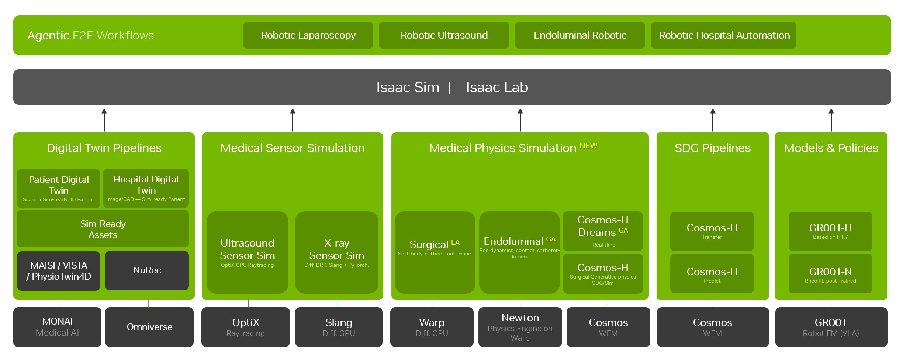

# NVIDIA Isaac for Healthcare

**NVIDIA Isaac For Healthcare is the three-computer solution for healthcare robotics**. It is a purpose-built platform for healthcare robotics developers built on NVIDIA’s Isaac framework for physical AI. It brings together simulation, synthetic data generation, foundation models, and accelerated runtime libraries across NVIDIA’s three-computer solution for robotics—enabling developers to build, train, validate, and deploy intelligent, autonomous healthcare robots. 
It provides the healthcare-specific building blocks needed to apply NVIDIA’s broader robotics stack to the unique challenges of healthcare—while allowing developers to benefit from the continued evolution of Isaac Sim, Isaac Lab, Newton, Cosmos, GR00T, and all other components of the NVIDIA three-computer robotics architecture. Using Isaac For Healthcare developers can build on the rapid advances in robotics by bringing healthcare-specific capabilities into the broader NVIDIA robotics stack such as Isaac Sim, Isaac Lab, and Newton, Cosmos—and apply them across healthcare robotics use cases, from medical robots such as surgical, endoluminal, imaging, diagnostic, and incisionless systems to hospital automation, including delivery, nursing, and logistics robots.

Isaac For Healthcare delivers six categories of capabilities spanning the complete Sim2Real development lifecycle for healthcare roboticists, from generating cohort of synthetic patients or hospital environments to simulating/generating realistic medical sensor data, to simulating robot–anatomy interactions, to training physical AI models/policies, to evaluating policies, and deploying autonomous systems in the real world.  Each capability is designed as a modular, reusable, and composable building block, allowing developers to deploy the full platform or adopt only the components they need, à la carte.

## 🚀 Getting started

Get started with NVIDIA Isaac for Healthcare by exploring our core components:

| Component | Description | Repository |
|-----------|-------------|------------|
| **🔧 Workflows** | Complete reference implementations for healthcare robotics applications | [View Workflows →](https://github.com/isaac-for-healthcare/i4h-workflows) |
| **📡 Sensor Simulation** | Virtual models for medical sensors and imaging modalities | [View Sensor Simulation →](https://github.com/isaac-for-healthcare/i4h-sensor-simulation) |
| **⚛️ Physics Simulation** | Physics simulations of devices and anatomy | [View Physics Simulation →](https://github.com/isaac-for-healthcare/i4h-physics-simulation) |
| **📦 Digital Twin Pipelines** | Collection of digital twin pipelines and simulation assets for medical devices and sensors | [View Digital Twins →](https://github.com/isaac-for-healthcare/i4h-digital-twin) |

## 📋 Components Overview

### 🔧 Workflows

The workflows module provides comprehensive reference implementations for healthcare robotics applications. They act as playbook/template for developers on how to bring all the components together into agent-ready sim-to-policy workflows from data generation → training → evaluation → deployment. Each workflow includes complete simulation environments, training datasets, pre-trained models, and deployment tools. Additionally, these workflows are represented in an agent-ready format, meaning developers can describe a task in natural language, while autonomous agents build, execute, evaluate, and iterate on the pipeline. 

**[→ Explore Workflows](https://github.com/isaac-for-healthcare/i4h-workflows)**

### 📡 Sensor Simulation

The sensor simulation module provides virtual models for a variety of medical sensors and imaging modalities, such as ultrasound and X-ray simulation. This provides developers with GPU-accelerated simulation of medical sensing modalities enabling realistic perception data generation for robot learning.

**[→ Explore Sensor Simulation](https://github.com/isaac-for-healthcare/i4h-sensor-simulation)**

### ⚛️ Physics Simulation

Medical robot autonomy developers face three fundamental gaps: data, generalization, and the slow development speed. Simulation offers a solution. However, what’s missing is an open-source, GPU-native sim framework enabling accelerated and scaled simulation enabling RL in medical robotics. Medical Physics Simulation’s goal is to enable the ecosystem to fill this gap. The physics simulation module provides Newton- and Warp-based simulation tools for deformable tissue and flexible robotic devices as well as real-time, action-conditioned generative surgical video simulation with Cosmos-H-Dreams.

**[→ Explore Physics Simulation](https://github.com/isaac-for-healthcare/i4h-physics-simulation)**

### 📦 Digital Twin Pipelines

Healthcare robots operate both inside the human body and across hospital environments. A major barrier is the lack of realistic, diverse data. This module enables developers to rapidly generate/reconstruct different hospital/anatomical environments for their robots to learn in. Specifically, the digital twin pipelines module provides imaging-based tools to create virtual models of anatomy, healthcare robots and hospital environments. It also contains an asset catalog with a collection of CAD models that can be used to simulate medical devices and sensors.

**[→ Explore Digital Twin Pipelines](https://github.com/isaac-for-healthcare/i4h-digital-twin)**
